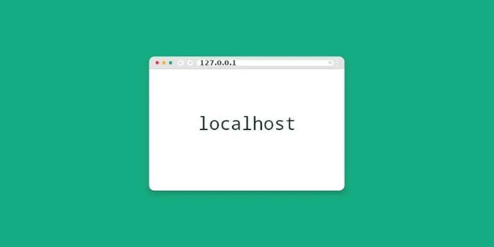
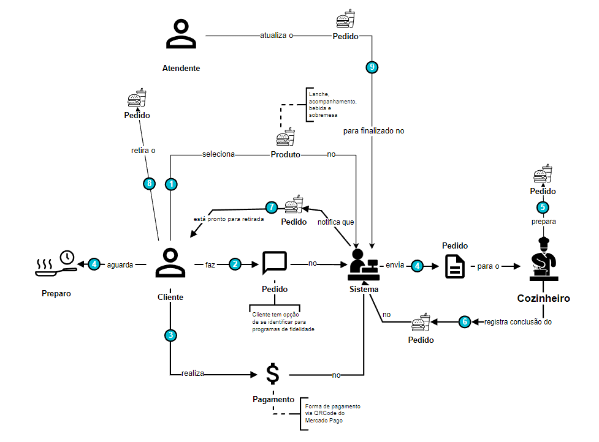
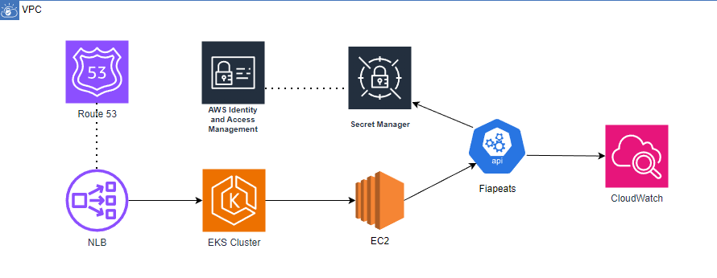

# FiapEats - Microserviço de Produtos

Este repositório contém o microserviço de produtos do FiapEats, uma aplicação que gerencia o cadastro, consulta, edição e exclusão de produtos. Este serviço foi refatorado a partir de um monolito para operar de forma independente, seguindo boas práticas de arquitetura de microserviços.


## Estrutura Projeto

### Diretórios usados
- /docs -> arquivos pertinentes a documentações
- /sqlScripts -> arquivos executados ao criar o ambiente pelo docker (create tables / insert data)
- /variables -> variaveis de ambiente usadas na app localmente, via kubernetes e via container
- /src -> código fonte da app
- /htmlTest -> Pagina HTML simples para visualizar o GET de produtos e pedidos
- /kubernetes -> configs de deployment,service,hpa e ingress da aplicação

### Plugins
- Jacoco -> cobertura de testes unitários e análise
- Spotless -> identação de código padronizada


---
## Ambiente Docker


Foi criado o arquivo na raiz docker-compose.yaml que contempla os 3 itens necessários para compor o ambiente completo de nosso sistema, sendo eles:
- Postgress: imagem do banco de dados usado no projeto
- PgAdmin: interface para manipularmos dados, verificar mudanças e administrar o banco
- Spring: app criada

desta maneira, a aplicação pode ser executada localmente e ela se conectará ao banco exposto pelo docker

### Executar todo o ambiente para homologação

Uma vez que o desenvolvimento seja concluído, para avaliar uma entrega de outro desenvolvedor o correto é executar todo o ambiente pelo docker, avaliando se a aplicação demonstra um comportamento diferente quando está dockerizada. 

Execute o seguinte comando:
```bash
docker compose --profile envfull up -d
```

### Zerando o ambiente e começando do zero

Caso seja necessário, o ambiente pode ser zerado ao deletar os containers, as imagens e os volumes criados. Dessa maneira o docker compose irá recriar todos os steps necessários para colocar um ambiente novo no ar. Para isso você deve:

#### Deletando todos os containers (perfil fullenv)
```bash
docker stop postgres_container pgadmin_container api-container && docker rm postgres_container pgadmin_container api-container
```

#### Deletando todos os containers (perfil database)
```bash
docker stop postgres_container pgadmin_container && docker rm postgres_container pgadmin_container
```

Após isto, delete também as imagens criadas para permitir que sejam baixadas

#### Deletando todas as imagens
```bash
docker rmi dpage/pgadmin4 app:latest postgres
```

Por fim, delete também os volumes criados, permitindo que scripts de inicializacao possam ser executados

#### Deletando todos os volumes
```bash
docker volume rm fiapeats-environment_pgadmin_data fiapeats-environment_postgres_data
```
---

## Ambiente desenvolvimento


### Executar em tempo de desenvolvimento

Enquanto estiver desenvolvendo, será necessário subir os containers de banco de dados e pgadmin, dessa forma a app poderá se conectar no banco e você poderá utilizar a interface do pgadmin para validar alterações. Utilize o comando abaixo para que o docker suba apenas o ambiente de banco de dados:

```bash
docker compose --profile database up -d
```

Caso seja necessário, siga o tutorial [Zerando o ambiente](#Zerando-o-ambiente-e-começando-do-zero) para zerar seu ambiente quando for necessário.

### Configurando variáveis de ambiente

O projeto tem uma pasta chamada 'variables' e contém dois arquivos, eles representam as variaveis que a app usa em tempo de desenvolvimento 'local.env' e em tempo de execução no container 'ambient.env'.

No arquivo docker a referência já está criada e nada precisa ser feito, porém localmente iremos necessitar adicionar em nossa IDE um plugin para substituir automaticamente os valores do arquivo na nossa app.

- No menu superior, clique em File.
- Selecione Settings (ou Preferences no macOS).
- Navegar até Plugins:
- No painel de configurações, vá até a seção Plugins, que geralmente está localizada na coluna à esquerda.
- No painel de Plugins, clique na aba Marketplace para acessar a loja de plugins.
- Na barra de pesquisa, digite Enviar.file e pressione Enter.
- Encontre o plugin Enviar.file na lista de resultados.
- Clique no botão Install ao lado do nome do plugin para iniciar a instalação.
- Após a instalação, você será solicitado a reiniciar o IntelliJ IDEA. Clique em Restart IDE para aplicar as mudanças.


Após isso, na aba de configurações de execução da app só habiliar o uso do plugin e referenciar o arquivo 'local.env' dentro da pasta variables


---
## Ambiente Kubernetes


A aplicação agora contém o diretório /kubernetes que pode ser aplicado para que rode em um contexto de pods e cluster.
Para que seja possível é necessário primeiro habilitar o kubernetes que já está contido no docker desktop ou instalar o minikube.

Uma vez instalado ou habilitado pelo docker desktop, siga os seguintes passos:

Para subir o banco de dados, ainda é necessário o docker-compose:

```bash
docker compose --profile database up -d
```

Para aplicar todas as configurações no kubernetes, execute o comando:
```bash
kubectl apply -f ./kubernetes --recursive
```

para confirmar que cada item foi aplicado, pode usar os comandos:
```bash
kubectl get pods # listar pods
```
```bash
kubectl get services # listar services criados
```
```bash
kubectl get hpa # listar configs de hpa
```
```bash
kubectl get ingress # listar config ingress
```
Ao finalizar, a aplicação passará pelo processo de subida no pod e poderá ser acessada através da url:
http://localhost:31000/fiapeats

Os logs da aplicação rodando no pod podem ser acessados ao executar o comando:
```bash
kubectl logs <nome-do-pod>
```

Para recuperar o nome do pod, execute o comando:
```bash
kubectl get pods # encontre o pod na lista
```

### Usando o dashboard do kubernetes


O dashboard já é aplicado ao cluster ao rodar o comando recursivo, portanto poderá ser acessado após gerar o token de acesso:
```bash
kubectl -n kubernetes-dashboard create token admin-user
```

Com o token em mãos, execute o comando abaixo (gere este comando em outro terminal, pois ficará bloqueado enquanto rodar o dashboard):
```bash
kubectl proxy
```

Por fim, para acessar o dashboard, utilize a url:
http://localhost:8001/api/v1/namespaces/kubernetes-dashboard/services/https:kubernetes-dashboard:/proxy/

ao logar, selecione o token e cole o valor gerado anteriormente.

---
# Documentação APIs (ordem de execução)

O Swagger da aplicação pode ser acessado através da URL: `http://localhost:8080/fiapeats/swagger-ui/index.html`.

Abaixo estão os principais endpoints para gerenciamento de produtos, com exemplos de requisições e respostas.

---

## 1. Criar um Produto
**Descrição**: Cria um novo produto no sistema.

**Endpoint**: `POST /produto`

**Exemplo de Requisição**:
```json
{
  "nome": "Refrigerante Guaraná",
  "descricao": "Refrigerante lata 350ml",
  "valor": 7.99,
  "categoria": "Bebida",
  "imagemUrl": "https://exemplo.com/imagem.png"
}
```

**Exemplo de Resposta (201 Created)**:
```json
{
  "id": "fc7c7f37-32ea-465c-ac4b-490685e5a55f",
  "nome": "Refrigerante Guaraná",
  "descricao": "Refrigerante lata 350ml",
  "valor": 7.99,
  "categoria": {
    "id": 3,
    "descricao": "Bebida"
  },
  "imagemUrl": "https://exemplo.com/imagem.png"
}
```

---

## 2. Listar Todos os Produtos
**Descrição**: Retorna uma lista de todos os produtos cadastrados.

**Endpoint**: `GET /produto`

**Exemplo de Resposta (200 OK)**:
```json
[
  {
    "id": "fc7c7f37-32ea-465c-ac4b-490685e5a55f",
    "nome": "Refrigerante Guaraná",
    "descricao": "Refrigerante lata 350ml",
    "valor": 7.99,
    "categoria": {
      "id": 3,
      "descricao": "Bebida"
    },
    "imagemUrl": "https://exemplo.com/imagem.png"
  },
  {
    "id": "fa0f9dde-b305-407b-869c-71045853dea8",
    "nome": "Pizza de Calabresa",
    "descricao": "Pizza grande com calabresa fatiada",
    "valor": 49.99,
    "categoria": {
      "id": 5,
      "descricao": "Pizza"
    },
    "imagemUrl": "https://exemplo.com/pizza.png"
  }
]
```

---

## 3. Buscar Produto por ID
**Descrição**: Retorna os detalhes de um produto específico com base no ID.

**Endpoint**: `GET /produto/{id}`

**Exemplo de Resposta (200 OK)**:
```json
{
  "id": "fc7c7f37-32ea-465c-ac4b-490685e5a55f",
  "nome": "Refrigerante Guaraná",
  "descricao": "Refrigerante lata 350ml",
  "valor": 7.99,
  "categoria": {
    "id": 3,
    "descricao": "Bebida"
  },
  "imagemUrl": "https://exemplo.com/imagem.png"
}
```

---

## 6. Listar Produtos por Categoria
**Descrição**: Retorna uma lista de produtos que pertencem a uma categoria específica.

**Endpoint**: `GET /produto/categoria/{categoria}`

**Exemplo de Resposta (200 OK)**:
```json
[
  {
    "id": "fc7c7f37-32ea-465c-ac4b-490685e5a55f",
    "nome": "Refrigerante Guaraná",
    "descricao": "Refrigerante lata 350ml",
    "valor": 7.99,
    "categoria": {
      "id": 3,
      "descricao": "Bebida"
    },
    "imagemUrl": "https://exemplo.com/imagem.png"
  },
  {
    "id": "a1b2c3d4-e5f6-7890-g1h2-i3j4k5l6m7n8",
    "nome": "Água Mineral",
    "descricao": "Garrafa de 500ml",
    "valor": 3.50,
    "categoria": {
      "id": 3,
      "descricao": "Bebida"
    },
    "imagemUrl": "https://exemplo.com/agua.png"
  }
]
```

---

## 7. Listar Produtos por Lista de IDs
**Descrição**: Retorna uma lista de produtos com base em uma lista de IDs fornecida.

**Endpoint**: `GET /produto/listarPorIds?uuids={id1},{id2},{id3}`

**Exemplo de Requisição**:
```
GET /produto/listarPorIds?uuids=fc7c7f37-32ea-465c-ac4b-490685e5a55f,fa0f9dde-b305-407b-869c-71045853dea8
```

**Exemplo de Resposta (200 OK)**:
```json
[
  {
    "id": "fc7c7f37-32ea-465c-ac4b-490685e5a55f",
    "nome": "Refrigerante Guaraná",
    "descricao": "Refrigerante lata 350ml",
    "valor": 7.99,
    "categoria": {
      "id": 3,
      "descricao": "Bebida"
    },
    "imagemUrl": "https://exemplo.com/imagem.png"
  },
  {
    "id": "fa0f9dde-b305-407b-869c-71045853dea8",
    "nome": "Pizza de Calabresa",
    "descricao": "Pizza grande com calabresa fatiada",
    "valor": 49.99,
    "categoria": {
      "id": 5,
      "descricao": "Pizza"
    },
    "imagemUrl": "https://exemplo.com/pizza.png"
  }
]
```


---

## Desenhos da arquitetura

### Requisitos de negócio



### Requisitos de infraestrutura



---

### Vídeo de demonstração da arquitetura/aplicação

https://www.youtube.com/watch?v=4SZC-1ZgfEY
