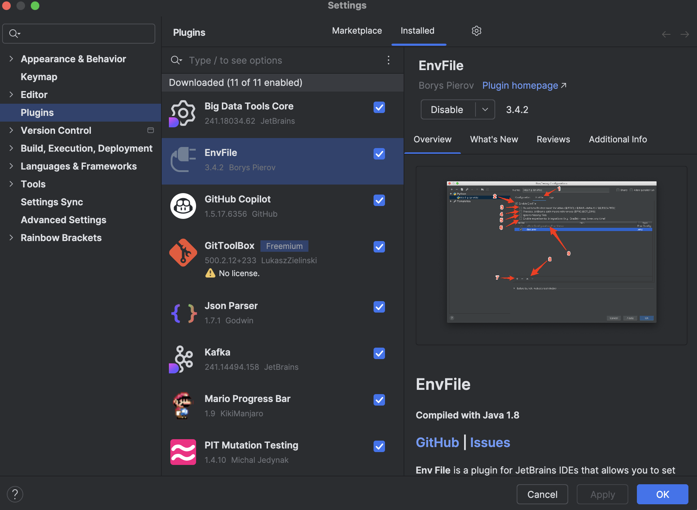

# TC-FiapEats
Projeto inicial para entrega do Tech Challenge

## Estrutura Projeto

### Diretórios usados
- /docs -> arquivos pertinentes a documentações
- /sqlScripts -> arquivos executados ao criar o ambiente pelo docker (create tables / insert data)
- /variables -> variaveis de ambiente usadas na app localmente e via container
- /src -> código fonte da app

### Plugins
- Jacoco -> cobertura de testes unitários e análise
- Spotless -> identação de código padronizada


## Ambiente Docker

Foi criado o arquivo na raiz docker-compose.yaml que contempla os 3 itens necessários para compor o ambiente completo de nosso sistema, sendo eles:
- Postgress: imagem do banco de dados usado no projeto
- PgAdmin: interface para manipularmos dados, verificar mudanças e administrar o banco
- Spring: app criada

desta maneira, a aplicação pode ser executada localmente e ela se conectará ao banco exposto pelo docker

### Executar todo o ambiente para homologação

Uma vez que o desenvolvimento seja concluído, para avaliar uma entrega de outro desenvolvedor o correto é executar todo o ambiente pelo docker, avaliando se a aplicação demonstra um comportamento diferente quando está dockerizada. 

Execute o seguinte comando:
```bash
docker compose --profile envfull up -d
```

### Zerando o ambiente e começando do zero

Caso seja necessário, o ambiente pode ser zerado ao deletar os containers, as imagens e os volumes criados. Dessa maneira o docker compose irá recriar todos os steps necessários para colocar um ambiente novo no ar. Para isso você deve:

#### Deletando todos os containers (perfil fullenv)
```bash
docker stop postgres_container pgadmin_container api-container && docker rm postgres_container pgadmin_container api-container
```

#### Deletando todos os containers (perfil database)
```bash
docker stop postgres_container pgadmin_container && docker rm postgres_container pgadmin_container
```

Após isto, delete também as imagens criadas para permitir que sejam baixadas

#### Deletando todas as imagens
```bash
docker rmi dpage/pgadmin4 app:latest postgres
```

Por fim, delete também os volumes criados, permitindo que scripts de inicializacao possam ser executados

#### Deletando todos os volumes
```bash
docker volume rm fiapeats-environment_pgadmin_data fiapeats-environment_postgres_data
```

## Ambiente desenvolvimento

### Executar em tempo de desenvolvimento

Enquanto estiver desenvolvendo, será necessário subir os containers de banco de dados e pgadmin, dessa forma a app poderá se conectar no banco e você poderá utilizar a interface do pgadmin para validar alterações. Utilize o comando abaixo para que o docker suba apenas o ambiente de banco de dados:

```bash
docker compose --profile database up -d
```

Caso seja necessário, siga o tutorial [Zerando o ambiente](#Zerando-o-ambiente-e-começando-do-zero) para zerar seu ambiente quando for necessário.

### Configurando variáveis de ambiente

O projeto tem uma pasta chamada 'variables' e contém dois arquivos, eles representam as variaveis que a app usa em tempo de desenvolvimento 'local.env' e em tempo de execução no container 'ambient.env'.

No arquivo docker a referência já está criada e nada precisa ser feito, porém localmente iremos necessitar adicionar em nossa IDE um plugin para substituir automaticamente os valores do arquivo na nossa app.

- No menu superior, clique em File.
- Selecione Settings (ou Preferences no macOS).
- Navegar até Plugins:
- No painel de configurações, vá até a seção Plugins, que geralmente está localizada na coluna à esquerda.
- No painel de Plugins, clique na aba Marketplace para acessar a loja de plugins.
- Na barra de pesquisa, digite Enviar.file e pressione Enter.
- Encontre o plugin Enviar.file na lista de resultados.
- Clique no botão Install ao lado do nome do plugin para iniciar a instalação.
- Após a instalação, você será solicitado a reiniciar o IntelliJ IDEA. Clique em Restart IDE para aplicar as mudanças.



Após isso, na aba de configurações de execução da app só habiliar o uso do plugin e referenciar o arquivo 'local.env' dentro da pasta variables


